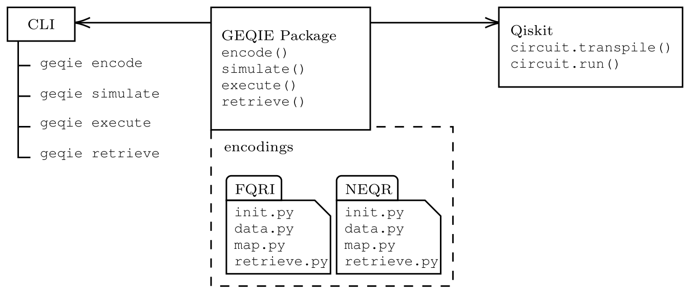
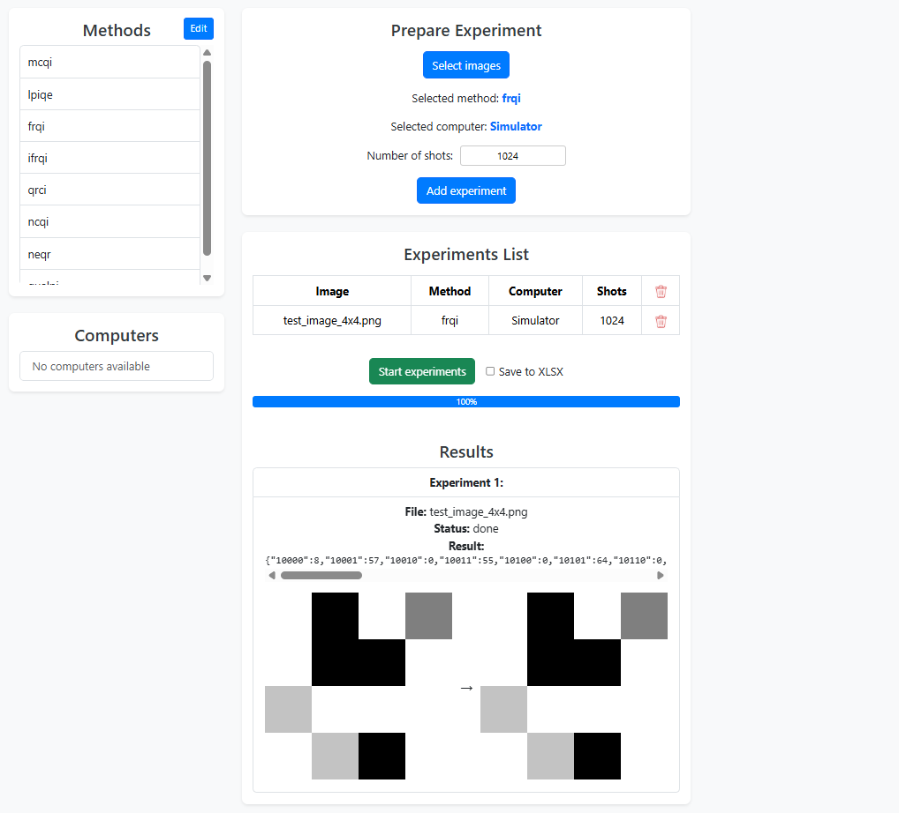

# optiq-geqie <!-- omit in toc -->


## Table of contents <!-- omit in toc -->

- [Description](#description)
- [Installation](#installation)
- [Examples](#examples)
  - [Notebooks](#notebooks)
  - [CLI usage](#cli-usage)
    - [Command `geqie list-encodings`](#command-geqie-list-encodings)
    - [Command `geqie encode`](#command-geqie-encode)
    - [Command `geqie simulate`](#command-geqie-simulate)
- [Playground (GUI)](#playground-gui)
- [Related research](#related-research)
- [Citation](#citation)
- [Acknowledgements](#acknowledgements)

Related documentation:
- [GEQIE GUI](gui/README.md)

## Description



## Installation

While in `geqie` directory invoke:

```bash
pip install .
```

## Examples

### Notebooks

See the `optiq-geqie/examples` directory for iPython notebooks.

### CLI usage

#### Command `geqie list-encodings`

```bash
geqie list-encodings
```

#### Command `geqie encode`

```txt
Usage: geqie encode [OPTIONS]

Custom encoding plugins:
  [all forbidden if --encoding is set, otherwise all required]
  --init TEXT
  --data TEXT
  --map TEXT

Other options:
  --encoding TEXT      Name of the encoding from 'encodings' directory
  --image-path TEXT    Path to the image file  [required]
  --grayscale BOOLEAN  Indication wether the image is grayscale  [default: True]
  -v, --verbose        Increase verbosity (can be used multiple times, up to
                       '-vvv')
  --help               Show this message and exit.
```

**Example**

```bash
geqie encode --encoding frqi --image-path assets/test_image.png
```

#### Command `geqie simulate`

```txt
Usage: geqie simulate [OPTIONS]

Custom encoding plugins:
  [all forbidden if --encoding is set, otherwise all required]
  --init TEXT
  --data TEXT
  --map TEXT

Other options:
  --encoding TEXT                 Name of the encoding from 'encodings'
                                  directory
  --image-path TEXT               Path to the image file  [required]
  --grayscale BOOLEAN             Indication wether the image is grayscale
                                  [default: True]
  -v, --verbose                   Increase verbosity (can be used multiple
                                  times, up to '-vvv')
  --n-shots INTEGER               Number of simulation shots
  --return-qiskit-result BOOLEAN  Return results directly from qiskit  [default:
                                  False]
  --return-padded-counts BOOLEAN  Return state counts including zero-count
                                  states  [default: False]
  --help                          Show this message and exit.
```

**Example**

```bash
geqie simulate --encoding frqi --image-path assets/test_image.png --n-shots 1024 --return-padded-counts true
```

## Playground (GUI)

Public GUI access: [https://web-staging-eb84.up.railway.app](https://web-staging-eb84.up.railway.app/) (Pending deployment on the university infrastructure).



See the [gui/README.md](gui/README.md) for instructions on running the GEQIE GUI locally.

## Related research

- [Main paper - GEQIE Framework for Rapid Quantum Image Encoding](https://arxiv.org/abs/2512.24973)
- [ICCS 2024 Poster](https://www.researchgate.net/publication/383184874_General_Quantum_Image_Representation_Model_and_Framework)


## Citation

If you use this code in your research, please cite the main paper:

*GEQIE Framework for Rapid Quantum Image Encoding* at https://arxiv.org/abs/2512.24973

## Acknowledgements

The authors would like to acknowledge that this repository is maintained for the OptiQ project. This Project has received funding from the European Union’s Horizon Europe programme under the grant agreement No 101080374-OptiQ. Supplementarily, the Project is co-financed from the resources of the Polish Ministry of Science and Higher Education in a frame of programme International Co-financed Projects. Disclaimer Funded by the European Union. Views and opinions expressed are however those of the author(s) only and do not necessarily reflect those of the European Union or the European Research Executive Agency (REA–granting authority). Neither the European Union nor the granting authority can beheld responsible for them.
