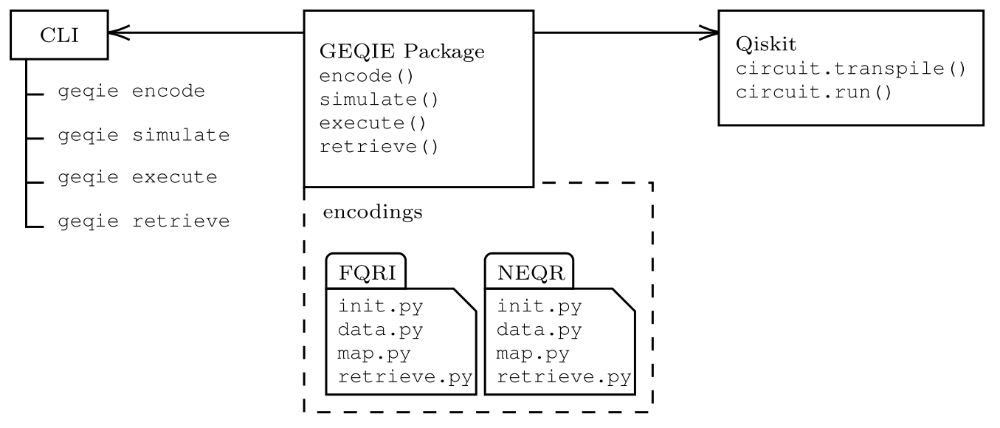
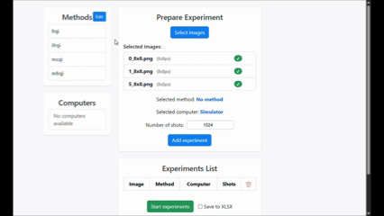

# geqie <!-- omit in toc -->


## Table of contents <!-- omit in toc -->

- [Description](#description)
- [Packages](#packages)
- [Installation](#installation)
- [Examples](#examples)
  - [Notebooks](#notebooks)
    - [Core GEQIE](#core-geqie)
    - [GEQIE QML](#geqie-qml)
  - [CLI usage](#cli-usage)
- [Playground (GUI)](#playground-gui)
- [Related research](#related-research)
- [Citation](#citation)
- [Acknowledgements](#acknowledgements)

Related documentation:
- [GEQIE Core Package](geqie/README.md)
- [GEQIE QML](geqie-qml/README.md)
- [GEQIE GUI](gui/README.md)

## Description



## Packages

| Package | Description |
|---|---|
| [`geqie/`](geqie/README.md) | Core quantum image encoding library with CLI |
| [`geqie-qml/`](geqie-qml/README.md) | QML integration extensions for geqie |

## Installation

```bash
pip install geqie/
pip install geqie-qml/   # optional, for QML support
```

## Examples

### Notebooks

See the [`examples/`](examples/) directory for iPython notebooks:

#### Core GEQIE

| Notebook | Description |
|---|---|
| [`encodings/frqi.ipynb`](examples/encodings/frqi.ipynb) | FRQI encoding |
| [`encodings/frqci.ipynb`](examples/encodings/frqci.ipynb) | FRQCI encoding |
| [`encodings/neqr.ipynb`](examples/encodings/neqr.ipynb) | NEQR encoding |
| [`encodings/ncqi.ipynb`](examples/encodings/ncqi.ipynb) | NCQI encoding |
| [`encodings/mcqi.ipynb`](examples/encodings/mcqi.ipynb) | MCQI encoding |
| [`encodings/mfrqi.ipynb`](examples/encodings/mfrqi.ipynb) | MFRQI encoding |
| [`encodings/ifrqi.ipynb`](examples/encodings/ifrqi.ipynb) | IFRQI encoding |
| [`encodings/qrci.ipynb`](examples/encodings/qrci.ipynb) | QRCI encoding |
| [`encodings/qualpi.ipynb`](examples/encodings/qualpi.ipynb) | QUALPI encoding |
| [`execute.ipynb`](examples/execute.ipynb) | Running encodings with the execute command |
| [`experiments_cli.ipynb`](examples/experiments_cli.ipynb) | CLI-based experiment workflows |


#### GEQIE QML


| Notebook | Description |
|---|---|
| [`geqie_qml_precompute.ipynb`](examples/geqie_qml_precompute.ipynb) | QML precomputation pipeline |


### CLI usage

See [geqie/README.md](geqie/README.md) for full CLI reference.

## Playground (GUI)

Public GUI access: [https://web-staging-eb84.up.railway.app](https://web-staging-eb84.up.railway.app/) (Pending deployment on the university infrastructure).



See the [gui/README.md](gui/README.md) for instructions on running the GEQIE GUI locally.

## Related research

- [Main paper - GEQIE Framework for Rapid Quantum Image Encoding](https://arxiv.org/abs/2512.24973)
- [ICCS 2024 Poster](https://www.researchgate.net/publication/383184874_General_Quantum_Image_Representation_Model_and_Framework)


## Citation

If you use this code in your research, please cite the main paper:

*GEQIE Framework for Rapid Quantum Image Encoding* at https://arxiv.org/abs/2512.24973

## Acknowledgements

The authors would like to acknowledge that this repository is maintained for the OptiQ project. This Project has received funding from the European Union’s Horizon Europe programme under the grant agreement No 101080374-OptiQ. Supplementarily, the Project is co-financed from the resources of the Polish Ministry of Science and Higher Education in a frame of programme International Co-financed Projects. Disclaimer Funded by the European Union. Views and opinions expressed are however those of the author(s) only and do not necessarily reflect those of the European Union or the European Research Executive Agency (REA–granting authority). Neither the European Union nor the granting authority can beheld responsible for them.
